# 📊 VRF-NBI: Python Code

## 📝 Description

This repository contains the **Python implementation** of the Varimax Rotated Factor Normal Boundary Intersection (VRF-NBI) method.

The code is designed to execute all stages of the VRF-NBI process using Python. It allows users to work with their own datasets, but the original dataset (from the published paper) is also provided. This dataset was generated via Design of Experiments (DOE) with responses from Computational Fluid Dynamics (CFD). Latent variable extraction was performed using Principal Components Factor Analysis (PCFA), and multiobjective optimization was done with the Normal Boundary Intersection (NBI) method. Evaluation metrics include Shannon Entropy (S) and Generalized Distance (GD).

> For Excel/VBA implementation of the method, see: [VRF-NBI for Excel/VBA](https://github.com/Matheuscp98/Normal_Boundary_Intersection)

**Note:** This code focuses on applying the method, not on visualization/plotting.

---

## 🛠️ How to Use

1. **Clone or download** this repository or [VRF-NBI.ipynb](VRF-NBI.ipynb).
2. **Open** the notebook in Jupyter.
3. **Install** the required Python libraries (see notebook header for details).
4. **Use** your own dataset or the provided sample dataset.
5. **Run** the code blocks to reproduce all steps and results.
6. The code includes detailed comments and is organized by functional blocks for easier understanding.

---

## 📚 Publications

In addition to ongoing manuscripts under review, the following public papers are already available:

- **Nonlinear Multiobjective Optimization of Efficiency Conditions using a CFD-DOE Hybrid Approach: A Practical Application in Centrifugal Fans for Industrial Ovens**  
  *(The main Python example dataset is from this work. Manuscript currently under review; )*
- **Strategies in Decision Making in a Multiobjective Context: Integration of DOE, NBI, and CFD in the Optimization of a Centrifugal Fan**  
  [Read here](https://publicacoes.softaliza.com.br/cilamce/article/view/10211/7235)
- **Optimizing Mesh and CFD Simulation Performance: A Multivariate Analysis Approach**  
  [Read here](https://publicacoes.softaliza.com.br/cilamce/article/view/8110/6998)
- **Otimização Multiobjetivo de Custos e Qualidade de Simulações de CFD: Explorando a Fronteira de Pareto**  
  [Read here](https://proceedings.science/sbpo/sbpo-2024/trabalhos/otimizacao-multiobjetivo-de-custos-e-qualidade-de-simulacoes-de-cfd-explorando-a?lang=pt-br)

---

## 🖼️ Figures

| Example                                      | Screenshot                        | Description                                        |
|-----------------------------------------------|-----------------------------------|----------------------------------------------------|
| VRF-NBI CCD Design                           | 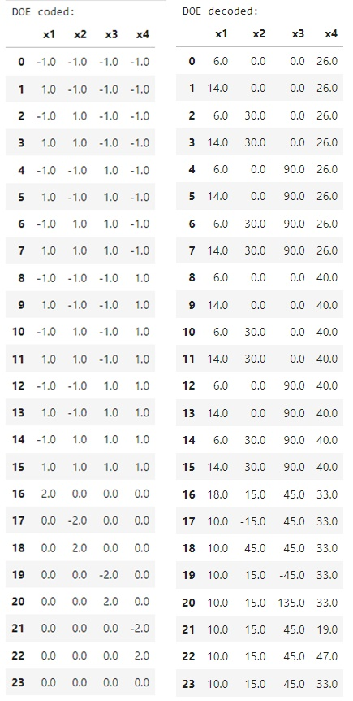 | Design of experiments using Central Composite Design (CCD). |
| VRF-NBI Responses                            | 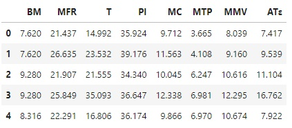 | Responses obtained from the experimental design (using CFD). |
| VRF-NBI Correlation and Covariance           | 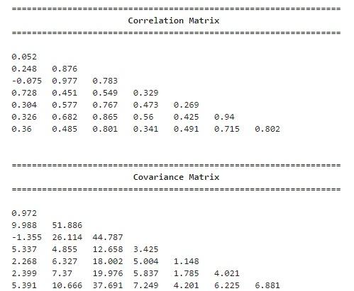 | Correlation and covariance matrix of the original responses. |
| VRF-NBI PCAFA                                | 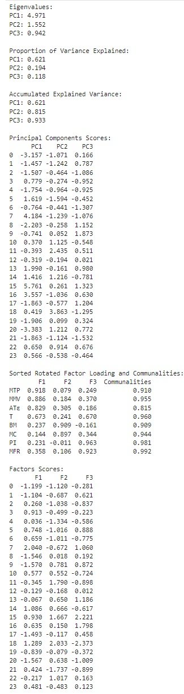 | Results from Principal Components Factor Analysis (PCAFA). |
| VRF-NBI DOE Analysis                         | 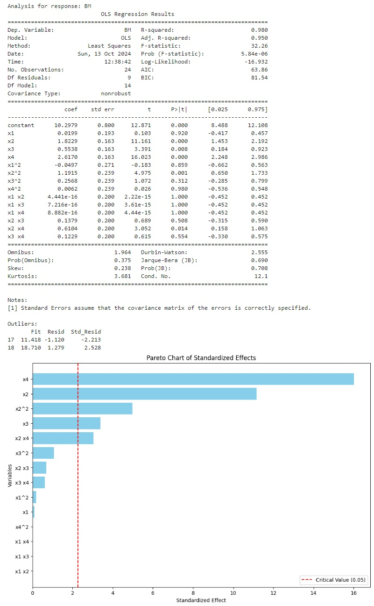 | Analysis of DOE for the original responses and the rotated factors. |
| VRF-NBI Coefficients                         | 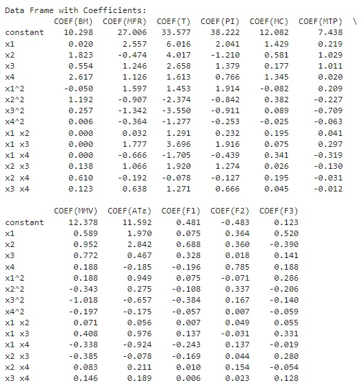 | Coefficients obtained from the analysis. |
| VRF-NBI Simplex Lattice Design               | 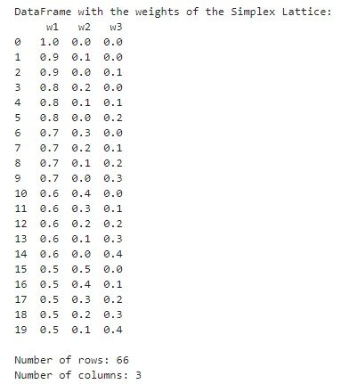 | Visual representation of the Mixture Simplex Lattice Design. |
| VRF-NBI Individual Optimization              | 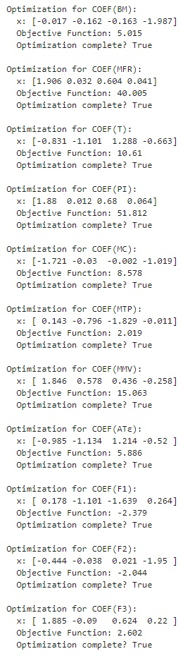 | Results of individual optimization (original responses and rotated factors). |
| VRF-NBI Payoff Matrix                        | 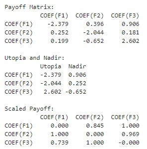 | Payoff matrix, Utopia, PseudoNadir, and Scaled Payoff. |
| VRF-NBI Additional Functions                 | 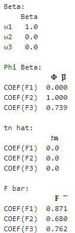 | Additional functions used in the NBI. |
| VRF-NBI Constraints                          | 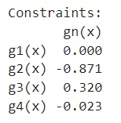 | Constraints used in the NBI process. |
| VRF-NBI Results                              | 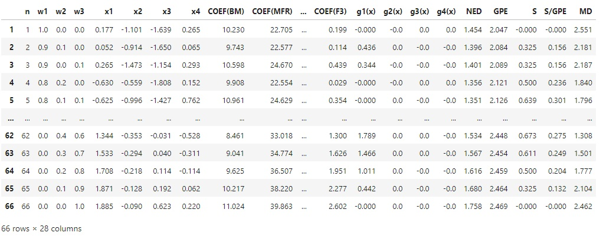 | Final results obtained from the VRF-NBI process with evaluation metrics. |

---

## 📬 Contact

---

> _Feel free to open issues or PRs, or reach out for collaboration or questions!_
