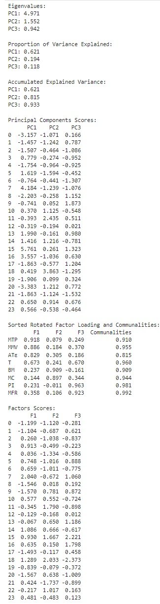

# 📊 VRF-NBI: Python Code

## 📝 Description

This repository contains the **Python implementation** of the **Varimax Rotated Factor Normal Boundary Intersection (VRF-NBI)** method.

The code is designed to execute **all stages** of the **VRF-NBI process** using **Python**. It allows users to work with their **own datasets**, but the **original dataset** (from the published paper) is also provided. This dataset was generated via **Design of Experiments (DOE)** with responses from **Computational Fluid Dynamics (CFD)**. **Latent variable extraction** was performed using **Principal Components Factor Analysis (PCFA)**, and **Multiobjective Optimization (MO)** was done with the **Normal Boundary Intersection (NBI)** method. **Evaluation metrics** include **Shannon Entropy (S)** and **Generalized Distance (GD)**.

The code is designed to execute **all stages** of the **VRF-NBI** process using **Python**. It allows users to work with their **own datasets**; moreover, the **original datasets** (from the published papers) are also provided. These datasets were generated via **Design of Experiments (DOE)** with responses from **Computational Fluid Dynamics (CFD)**. **Latent variable extraction** was performed using **Principal Components Factor Analysis (PCFA)**, and **Multiobjective Optimization (MO)** was conducted with the **Normal Boundary Intersection (NBI)** method. **Evaluation metrics** include **Shannon Entropy (S)** and **Generalized Distance (GD)**.

> For **Excel/VBA implementation** of the method, see: [**VRF-NBI for Excel/VBA**](https://github.com/Matheuscp98/Normal_Boundary_Intersection)

**Note:** This code focuses on **applying the method**, not on **visualization/plotting**.

---

## 📚 Publications

In addition to ongoing manuscripts under review, the following public papers are already available:

- **A Hybrid Multivariate Normal Boundary Intersection Approach with Post-Optimization Assisted by Mixture Design of Experiments**  
  [Read here](https://www.sciencedirect.com/science/article/pii/S0952197625025412)
- **Nonlinear Multiobjective Optimization of Efficiency Conditions using a CFD-DOE Hybrid Approach: A Practical Application in Centrifugal Fans for Industrial Ovens**  
  [Read here](https://www.sciencedirect.com/science/article/pii/S2451904925006900)
- **Strategies in Decision Making in a Multiobjective Context: Integration of DOE, NBI, and CFD in the Optimization of a Centrifugal Fan**  
  [Read here](https://publicacoes.softaliza.com.br/cilamce/article/view/10211/7235)
- **Nonlinear Multi-Objective Optimization of the Efficiency Conditions of a Centrifugal Fan for Ovens** (*Otimização Não-linear Multiobjetivo das Condições de Eficiência de um Ventilador Centrífugo para Fornos*)  
  [Read here](https://www.even3.com.br/anais/iepg-summit-2023-388661/758560-otimizacao-nao-linear-multiobjetivo-das-condicoes-de-eficiencia-de-um-ventilador-centrifugo-para-fornos/) 
- **Optimizing Mesh and CFD Simulation Performance: A Multivariate Analysis Approach**  
  [Read here](https://publicacoes.softaliza.com.br/cilamce/article/view/8110/6998)
- **Multiobjective optimization of CFD simulation costs and quality: Exploring the Pareto frontier** (*Otimização Multiobjetivo de Custos e Qualidade de Simulações de CFD: Explorando a Fronteira de Pareto*)  
  [Read here](https://proceedings.science/sbpo/sbpo-2024/trabalhos/otimizacao-multiobjetivo-de-custos-e-qualidade-de-simulacoes-de-cfd-explorando-a?lang=pt-br)
- **Factorial analysis by principal components applied to multi-objective optimization in the turning of hardened AISI 52100 steel** (*Análise Fatorial por Componentes Principais Aplicada à Otimização Multiobjetivo no Torneamento do Aço Endurecido AISI 52100*)  
  [Read here](https://proceedings.science/sbpo/sbpo-2025/trabalhos/analise-fatorial-por-componentes-principais-aplicada-a-otimizacao-multiobjetivo?lang=pt-br)
- **Modeling and optimization of roughness parameters in the turning process** (*Modelagem e Otimização de Parâmetros de Rugosidade no Processo de Torneamento*)  
  [Read here](https://proceedings.science/sbpo/sbpo-2025/trabalhos/modelagem-e-otimizacao-de-parametros-de-rugosidade-no-processo-de-torneamento?lang=pt-br)
- **Hybrid CFD-DOE Strategy for Multiobjective Optimization in Centrifugal Fans** (*Estratégia Híbrida CFD-DOE para Otimização Multiobjetivo em Ventiladores Centrífugos*)  
  [Read here](https://www.even3.com.br/anais/3-science-business-connection/1087045-estrategia-hibrida-cfd-doe-para-otimizacao-multiobjetivo-em-ventiladores-centrifugos/)
- **Abordagem Pareto-Ótima de Eficiência de Simulação pelo Equilíbrio de Custos e Precisão para Ciência e Negócios** (*A Pareto-Optimal Approach to Simulation Efficiency by Balancing Cost and Accuracy for Science and Business*)  
  [Read here](https://www.even3.com.br/anais/3-science-business-connection/1087133-abordagem-pareto-otima-de-eficiencia-de-simulacao-pelo-equilibrio-de-custos-e-precisao-para-ciencia-e-negocios/)

---

## 🛡️ Intellectual Property & Patent Registration

This repository is associated with a **computer program registration** filed with the **Instituto Nacional da Propriedade Industrial (INPI)**, in **Brazil**.

**Registration details:**

- **Title:** Varimax-Rotated Factor Normal Boundary Intersection
- **Registration Number:** BR512025005973-6
- **Type:** Computer Program Registration
- **Jurisdiction:** Brazil

---

## 🛠️ How to Use

1. **Clone or download** this repository or [**Script VRF-NBI**](VRF-NBI.ipynb).  
2. **Open** the notebook in **Jupyter**.  
3. **Install** the **required Python libraries** (see notebook header for details).  
4. **Use** your own dataset or the **provided sample dataset**.  
5. **Run** the code blocks to reproduce **all steps and results**.  
6. The code includes **detailed comments** and is **organized by functional blocks** for easier understanding.  

---

## 🖼️ Figures

| Example                                      | Screenshot                        | Description                                        |
|-----------------------------------------------|-----------------------------------|----------------------------------------------------|
| VRF-NBI CCD Design                           |  | Design of experiments using Central Composite Design (CCD). |
| VRF-NBI Responses                            |  | Responses obtained from the experimental design (using CFD). |
| VRF-NBI Correlation and Covariance           |  | Correlation and covariance matrix of the original responses. |
| VRF-NBI PCFA                                 |  | Results from Principal Components Factor Analysis (PCFA). |
| VRF-NBI DOE Analysis                         |  | Analysis of DOE for the original responses and the rotated factors. |
| VRF-NBI Coefficients                         |  | Coefficients obtained from the analysis. |
| VRF-NBI Simplex Lattice Design               |  | Visual representation of the Mixture Simplex Lattice Design. |
| VRF-NBI Individual Optimization              |  | Results of individual optimization (original responses and rotated factors). |
| VRF-NBI Payoff Matrix                        |  | Payoff matrix, Utopia, Pseudo Nadir, and Scaled Payoff. |
| VRF-NBI Additional Functions                 |  | Additional functions used in the NBI. |
| VRF-NBI Constraints                          |  | Constraints used in the NBI process. |
| VRF-NBI Results                              |  | Final results obtained from the VRF-NBI process with evaluation metrics. |

---

## 📬 Contact

---

> _Feel free to open issues or PRs, or reach out for collaboration or questions!_
